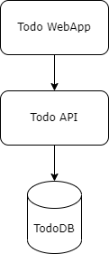
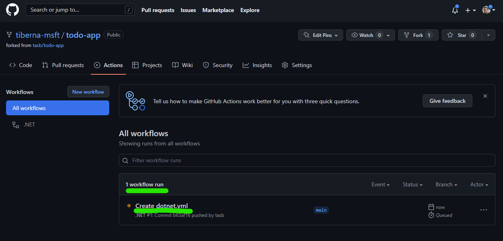

<!-- no toc -->
# Lab 01 - Plan, Build & Test

On this lab you'll have an hands-on experience with git repos, creating pull requests, make link between issues (work items) and code/PR's and create your first automation for build & test.

## On this lab

- [Getting Started](#getting-started)
- [Test locally](#test-locally)
- [Create automation](#create-automation)
- [Enforce Pull Request Usage](#enforce-pull-request-usage)
- [Open an issue](#open-an-issue)
- [Change your code](#change-your-code)
- [Create Pull Request](#create-pull-request)
- [Clean Up Local Repo](#clean-up-local-repo)

## Getting Started

Before your begin, please take another look on [prerequisites](../README.md#prerequisites) for your operating system.

On the labs of this course you'll work on as simple ToDo List app with the following architecture.



Navigate to <https://github.com/tasb/todo-app> to have access to source code.

First step is to fork this repo to your account. Click on Fork button on top right of the page, select your account on `Owner` drop-down box, define a name for the repo and click on `Create Fork` green button, as depicted on next image.


After fork process is completed you have access to this repo on your account.

Now you're ready to start testing this app!

## Test locally

Now you'll test your application locally. You'll build your app and running the unit test. Since this application needs a database (PostgreSQL) you'll not be able to run the app and see it running (you may do it by yourself if you want!).

First step is to clone the repo to your machine. Click on `<> Code` green button of your repo contents to have access to your repo URL. You may click on the button after the URL to copy that value, as shown on next image.


Now open a terminal on your machine and execute the following command (without the `<` and `>` characters).

```bash
git clone <REPO_URL>
```

This will create a new folder on your current folder with all the contents of your repo. If your forked your repo with using the same name, the folder must be named `todo-app`.

Navigate to that folder (on your terminal).

```bash
cd todo-app
```

And now run the following command to check that you have all the history of the repo on your machine.

```bash
git log --oneline
```

You should get an output like the one on the following image.


Now let's confirm your project builds correctly. Run the following command to build all components.

```bash
dotnet build
```

You should get an output like this.


Then it's time to run unit tests. Execute the following command to run all unit test. This more complex command is to enable you to get a more detailed description about performed tests.

```bash
dotnet test -v quiet --nologo -l:"console;verbosity=normal"
```

At the end you may have an output like this.


At the end of this phase you confirmed that your project is passing all the unit tests (and may not be free of bugs :))

## Create automation

Being able to run build and test commands on you're machine are important for debug purpose but enable automation bring collaboration within your team to another level.

Return to your GitHub web interface to create your first automation. First, select `Actions` option on top of repo list of files and on the new screen find the option named `.NET` as shown on next image. Be aware that `.NET` option may be on another place on the screen but make you find that specific option.


Click on `Configure` button and GitHub automatically creates a default workflow to build and test a .NET application. You should see a screen like this.


GitHub uses a Pipeline as Code approach, meaning your workflow is defined as a source code file and you'll be stored on your repo.

Let's make small changes on this workflow to get more insights about your tests.

First, you need to change .NET version to `6.0.x`. For that you may replace line #19, from this:

```yaml
dotnet-version: 5.0.x
```

To this:

```yaml
dotnet-version: 6.0.x
```

Then, let's set a specific output for your test command to be used by another task to grant you a detailed report. On line #25, you may add an additional parameter and your line may look like this.

```yaml
run: dotnet test --no-build --verbosity normal --logger "trx;LogFileName=test-results.trx"
```

To complete your workflow, let's add the following action at the end of default workflow. Be aware that this file is an YAML file and the whitespaces must be carefully added since they have impact on file structure and validity.

```yaml
- name: Test Report
  uses: dorny/test-reporter@v1
  if: always()
  with:
    name: TodoApp Tests
    path: '**/TestResults/*.trx'
    reporter: dotnet-trx
```

This code must be at the same level as the last action. At the end your workflow must be similar to the following.


Let's have a look on your workflow. On initial lines you see this.

```yaml
on:
  push:
    branches: [ "main" ]
  pull_request:
    branches: [ "main" ]
```

Those are the trigger of your pipeline meaning that anytime a push is made on `main` branch or a pull request with `main` branch as final target is created or updated, your workflow will run automatically.

After you have several tasks (actions) that will be run very similar to the ones you have ran on your machine.

```yaml
- uses: actions/checkout@v3
- name: Setup .NET
    uses: actions/setup-dotnet@v2
    with:
    dotnet-version: 6.0.x
- name: Restore dependencies
    run: dotnet restore
- name: Build
    run: dotnet build --no-restore
- name: Test
    run: dotnet test --no-build --verbosity normal --logger "trx;LogFileName=test-results.trx"
```

`checkout` action will clone your repo, then you specify which .NET version you want to use and the following `dotnet` commands are the ones you've done on your machine (you didn't run `dotnet restore` but `dotnet build`have done that implicitly for you)

So let's commit this file to your repo and see your workflow running. To do that, click on `Start commit` green button on top right and then click on `Commit new file button`.


You may add a customized message to your commit but by default GitHub will add one for you, related with the changes you made. On this case will be `Created dotnet.yml`.

After doing the commit, you may navigate again to `Actions` option. Now you'll check that your workflow started automatically. That happened because you made a push directly to the `main` branch.



You see on the list that your pipeline is running because have a orange dot before the commit message you have added to your commit. Now click on that line with commit message (`Created dotnet.yml` by default) to have more details. You may need to wait some seconds until your workflow is finished.


On left side you see two jobs `build` and `TodoApp Tests`. The former will show you the logs of all executed actions, the latter will show you a detailed report of your unit test. Click on both to check the details and you may have a test report like this.


Great! You're test ran perfectly and now every time you make a change on `main` branch or create/update a Pull Request targeting `main` branch, this workflow will run automatically!

## Enforce Pull Request Usage

Before starting change your code, let's add some policies to enforce Pull Requests on `main` branch and enable Issues on your repo.

Click on `Settings` option on tool bar as shown on next image.


On main screen, check the `Issues` option to enable GitHub Issues on your repo.


Next navigate to `Branches` option available on the left side option, under block `Code and Automation`. On that screen click on `Add rule` button as shown on next image.


On new screen, add `main`on `Branch name pattern`. This option will enable this policy on `main` branch, meaning that all merges (updates) on that branch must came from a Pull Request.

You need to enable the option `Require a pull request before merging` to enable the policy. You need to **disable** `Required approvals` option, since you're the only user on that repo and by default, GitHub don't allow that the creator of a pull request can approve his own changes.

At the end, your rule must have the following details.


After making this configuration, you need to click on `Create` green button on the bottom of this page. You may need to enter again your password to confirm this change. After you do that you must see a similar screen like the one below.


Now you're ready to change your code!

## Open an issue

As a good practice you should always have a work item to support any change on your code. On GitHub that is done using GitHub Issues.

The change we will do is a simple update on page main header so let's create an issue for it. Start to navigate to `Issues` option on top of your repo.


Then click on `New Issue` button, add the details about your change and assign yourself to the issue.


Then click on `Submit new issue` button and your issue will be created. After that you may see a screen where you may have a conversation about this issue with another members of your team.

To see your newly created issue on the list, you may click on `Issue` option that your clicked previously.


## Change your code

To change your code you need to "return" to your machine to properly update your code.

Remember two things. First, your `main` branch was changed when you added your workflow. Second, your `main` branch is closed to direct changes so you need to use an additional branch.

To update your local repo, you need to go to the terminal again and run the following command.

```bash
git pull
```

This will update all your file and Git database on your local repo.

Now, with last version of your codebase you may do your update.

First, let's create and move to the a new branch.

```bash
git checkout -b topic/update-title
```

Ypu may use any name for your branch but using `topic/update-title` you are following some best practices. First, using `topic/` you're grouping this branch on all topic branches that you may create on your repo.

Then, using `update-title` you're using a short name to identity what you're doing. Another option could be using the number o the issue that you're working on like `issue-1`.

To update the web app, open your code on a code editor of your choice an navigate to the following file `src/TodoWebapp/Views/Shared/_Layout.cshtml`

Find line #15 and change from:

```csharp
<a class="navbar-brand" asp-area="" asp-controller="Home" asp-action="Index">TodoWebapp</a>
```

To:

```csharp
<a class="navbar-brand" asp-area="" asp-controller="Home" asp-action="Index">My ToDo App</a>
```

Your code is changed and you fulfill what was asked on the issue you're dealing with.

Let's push this change to your remote repo.

```bash
git commit -a -m "Title updated #1"
```

Pay attention to commit message and don't forget to add `#1` part. This will automatically link your commit with the issue that you created before.

This link can have additional feature, like closing automatically you're issue. Please check [Closing Issues via Commit Messages](https://github.blog/2013-01-22-closing-issues-via-commit-messages/) for more details.

Now you're ready to add this change to you remote repo.

```bash
git push
```

You got an error right? :) That's because you don't have yet the new branch on remote repo. Git automatically give you the command you need to execute (can be slightly different if you use another branch name)

```bash
git push --set-upstream origin topic/update-title
```

You should see an output like this stating that you created a new branch remotely.


If you return to your GitHub page and click on `Code` option (left from previously select `Issues` option), you may confirm that the new branch were created, after click on dropdown with `main` as selected option.


Additionally you see a banner stating that a new branch was created and you may create a new Pull Request. Let's see how to do it!

## Create Pull Request

To create your pull request, click on the button `Compare & pull request` on the banner on top of your repo.

Because you forked this repo from another one, you can create pull requests to make updates on original repo. This is one of the key feature of Git related with collaboration on distributed team, open source methodologies and innersourcing.

On this particular case, we only want to update `main` branch on our repo, so you need to reflect that on the target branch.


You may check that the title of your pull request is already set with you commit message.

Recall that you added a link from your commit to your issue. Let's do it with your Pull Request too. Now that you are doing a final step toward reaching `main`branch, you may make the link and close the issue.

Do close and link the issue with only one step, you may add a comment when you are creating your Pull Request stating that. Add `Closes #1` comment on your Pull Request. You'll see that when you enter `#` character you automatically have access to a list of issues to select from. After you enter the command, the `#1` became a link direct to your issue.


Let's proceed clicking on `Create pull request` button to get access to additional details. As soon as your pull request starts, you may see that some checks are done.


First, is about merge conflict. Pull requests automatically check if a merge conflict may arise if you do the merge. If so, you're not able to finish your pull request.

Second, your workflow starts to run automatically as expected and you need to wait until if finished successfully to proceed on your pull request.


If you navigate to your link you still see its status as Open. This is the expected behavior since the Pull Request was not completed yet. The issue is only closed after Pull Request is completed.

Now you are ready to complete your Pull Request and do the merge to the `main`branch. As stated before, on this lab we are not able to add reviewers since your doing this steps alone and GitHub don't allow you to approve your own changes.

Click on `Merge Pull Request` green button, you may leave or update the message that will be added to the merge commit you're about to perform and click on `Confirm Merge`

Because you created a topic branch that is a short-lived branch, you may (let say, must... :)) delete your branch to keep your branch list clean.

You have that option directly after merge is completed so click on the button `Delete Branch`.


Finally, you may navigate to your issue and confirm that its state changed to closed and you have a reference to the pull request on the `Development` block on the left side.


## Clean Up Local Repo

You already clean up your remote repo but due to Git being a distributed version control system, your local repo didn't received any change automatically.

First step, is to move again to `main` branch.

```bash
git checkout main
```

Now you need to update your branch with the last merge performed on remote side through Pull Request.

```bash
git pull
```

Last step is to keep your repo clean and ready to develop another improvement your code base. For that you need to delete the branch created to update main page title.

```bash
git branch -d topic/update-title
```

And it's done! You may repeat this process as needed to bring more value to your end user!

## Congratulations

You've successfully completed this lab! Now you may feel more prepared to implement Pull Request and basic automation on your projects!

---

[Return home >](../README.md#labs)
