<!-- no toc -->
# Lab 02 - Full CI/CD

On this lab you'll complete to create your full CI/CD pipeline that will deploy your Todo App on Azure infrastructure created through Infra as Code approach

## On this lab

- [Prerequisites](#Prerequisites)
- [Application Architecture](#application-architecture)
- [Configure GitHub repo](#configure-github-repo)
- [Create Azure Storage](#create-azure-storage)
- [Create Terraform scripts](#create-terraform-scripts)
- [Update GitHub workflows](#update-github-workflows)
- [Run your pipeline](#run-your-pipeline)
- [Enable security tools](#enable-security-tools)
- [Create SAST pipeline](#create-sast-pipeline)
- [Clean up resources](#clean-up-resources)

## Prerequisites

To complete this lab you need:

- Completed [Lab 01 - Plan, Build & Test](lab01.md), or
- Complete the following steps of [Lab 01 - Plan, Build & Test](lab01.md):
  - [Getting Started](lab01.md#getting-started)
  - [Enforce Pull Request Usage](lab01.md#enforce-pull-request-usage)

## Application Architecture

During this lab you'll work on as simple ToDo List app with the following architecture.

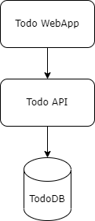

At the end this lab you will create the following infrastructure representing Staging (`stg`) and Production (`prod`) environment

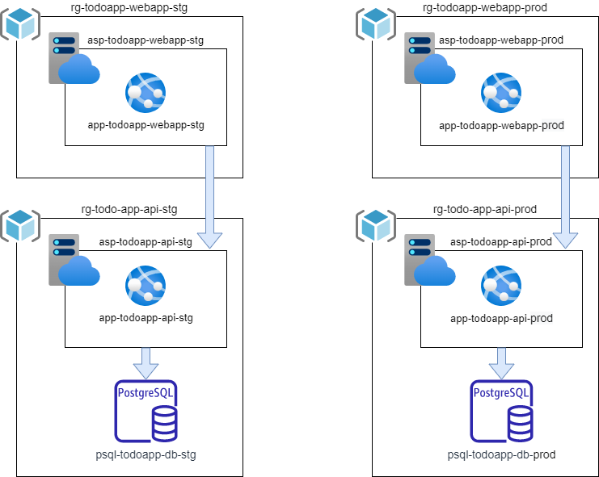

Resources to be created:

- 1 resource group per each environment and each application component
  - This is mandatory since in Azure all resources need to be create inside a [Resource Group](https://docs.microsoft.com/en-us/azure/azure-resource-manager/management/manage-resource-groups-portal#what-is-a-resource-group)
- 1 App Service Plan per each environment and each web component (Todo WebApp & Todo API)
  - [App Service Plan](https://docs.microsoft.com/en-us/azure/app-service/overview-hosting-plans) defines a set of compute resources for a web app to run.
- 1 Azure Database for PostgreSQL per environment
  - [Azure Database for PostgreSQL](https://docs.microsoft.com/en-us/azure/postgresql/single-server/overview) is a relational database service in the Microsoft cloud based on the PostgreSQL open source relational database

---
**NOTE**

All resources from all training audience will be created on the same subscription so you need to create a prefix for all your resources. But default, let's use the initials of your name.

For example: Yangchen Casalinho Espírito Santo[^1] = yces

[^1]: Name generated by [Gerador de Nomes](https://gerador-nomes.herokuapp.com/)

---

## Configure GitHub repo

---
**NOTE**

You'll receive on private Teams chat your Azure credentials with following format.

```JSON
{
  "clientId": "XXXXXXXXXXXXXXXXXXXXXXX",
  "clientSecret": "XXXXXXXXXXXXXXXXXXXXXXX",
  "subscriptionId": "XXXXXXXXXXXXXXXXXXXXXXX",
  "tenantId": "XXXXXXXXXXXXXXXXXXXXXXX",
  "resourceManagerEndpointUrl": "https://management.azure.com/"
}
```

---

First, you need to add your credentials as secrets on your repo.

Navigate to Settings > Secrets > Actions, click on `New repository secret` and repeat the process to create 5 secrets with following details:

1) Name: `AZURE_CREDENTIALS` // Value: JSON received on your private chat
2) Name: `ARM_CLIENT_ID` // Value: Property `clientId` from the JSON
3) Name: `ARM_CLIENT_SECRET` // Value: Property `clientSecret` from the JSON
4) Name: `ARM_SUBSCRIPTION_ID` // Value: Property `subscriptionId` from the JSON
5) Name: `ARM_TENANT_ID` // Value: Property `tenantId` from the JSON

Then, let's create the environments to be used by your CD pipeline.

Navigate to Settings > Environments and click on `New environment`.

First, you may create Staging environment. On environment name add `stg` and click on `Configure environment`.

On the new screen, click on the `Add Secret` link at the end the screen and fill the form with the following parameters:

- Name: `DB_PASSWORD`
- Value: `P@ssw0rd`

Finally, let's create Production environment. Repeat the process clicking on `New environment` button and set environment name as `prod`.

On the new screen, click on the `Add Secret` link at the end the screen and fill the form with the following parameters:

- Name: `DB_PASSWORD`
- Value: `P@ssw0rd`

In order to better protect this environment, you will add two protection rules to it.

On `Environment protection rules` block, enable `Required reviewers` checkbox and add your GitHub username on the input box.

You need to click on `Save protection rules` to save this setting. Any other setting don't need to be explicit saved.

Doing this you are creating a pre-approval gate on your production environment, meaning someone (on this case, you) need to explicitly approve the deployment on the production environment.

Then, on `Deployment branches` block, click on the dropdown and select `Selected branches` option. Now you need to define from which repo branch are you allowed to deploy to this environment.

Click on `Add deployment branch rule` and set `main` on `Branch name pattern:` input box.

## Create Azure Storage

You need an Azure Storage to keep your Terraform state to be used when you execute your pipeline and have access to last know state created by Terraform tool.

Navigate to [Azure Portal](https://portal.azure.com/) and login with your company credentials (due to SSO you may automatically be logged in).

On top search box, search for `Storage Accounts` and click on the result with the same name as stated on following image.

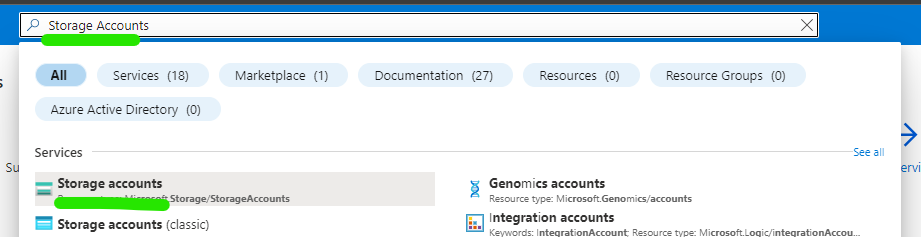

Then you may click on `Create storage account` button in the middle of the page.

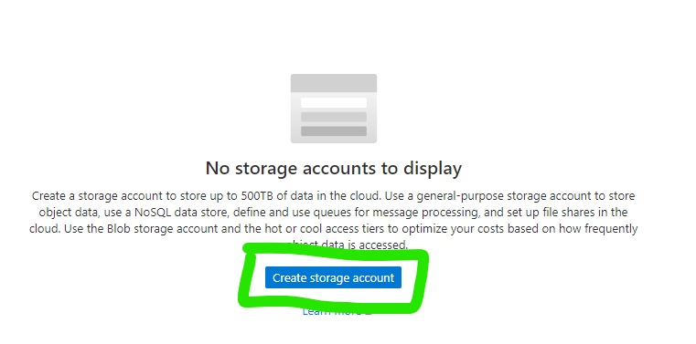

You start the wizard to create your Storage Account. You need to configure 3 fields:

1) Resource Group
   - Click on the link `Create new` below dropdown box
   - On resource group name add `<your-prefix>-tfstate-rg`
   - Click on `OK`
2) Storage account name
   - Storage accounts on Azure need to have an unique on ALL Azure subscription
   - Name is mandatory to be all in small caps
   - Add the following name `<your-prefix>tfstatestg`
3) Region
   - Select `West Europe`

Click on `Review + Create` button for Azure Resource Manager validate your configuration.

After that validation finished successfully, `Create` button will turn blue and you may click on it.

The process to create your storage account just started and you need to wait a couple of minutes until have access to your resource.

When the creation finished with success you get a screen like this.

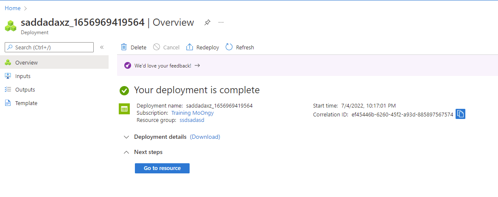

To finalize this configuration, you need to create a container inside your Azure Storage Account.

A container can be seen as a folder and is where Terraform state files will be stored.

Click on `Go to resource` blue button and you get access to all details and configurations of your Azure Storage.

Click on `Containers` option on left side bar, then on `+ Container` and finally add `tfstate` as container name and select `Blob (anonymous read access for blobs only)` as `Public access level` and to finalize click on `Create` button.

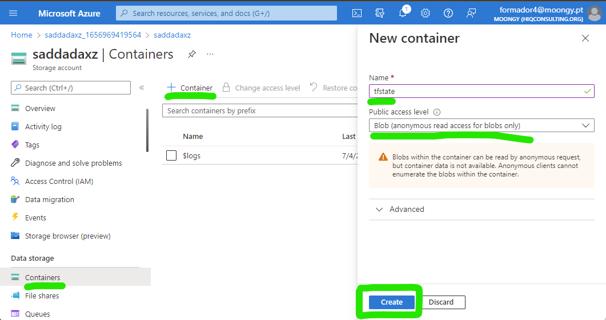

Now you have everything ready to start to implement your Infra as Code scripts and update (or create) your workflows.

## Create Terraform scripts

After you have the repo cloned on your machine you need to create a new branch to start to develop any additional code since you enable the need to use Pull Requests to update `main` branch.

To be sure you have last version, do a clean up on your local repo. First, move your repo to `main` branch.

```bash
git checkout main
```

Then, get all update from this remote repo.

```bash
git pull
```

Now you're ready to create a new branch named `add-iac`.

```bash
git checkout -b add-iac
```

Create two new folders:

1) `deploy` > `terraform` > `todo-api`
2) `deploy` > `terraform` > `todo-webapp`

Inside each folder you will create the Terraform files needed to deploy (and then destroy) your infrastructure:

- `main.tf`: main file where you define resources to be created
- `variables.tf`: each block of this file defines a variable/parameter to be used on your IaC process to make it more dynamic
- `terraform.tfvars`: where you define default values for variables/parameters defined on `variables.tf` file
- `output.tf`: where you define outputs of your IaC scripts that can be used during your CD process to set some variables

On `todo-api` folder, create a file named `variables.tf` with following content.

```hcl
variable "env" {
    type = string
    description = "Environment name to deploy"
    nullable = false
}

variable "location" {
    type = string
    description = "The Azure Region in which all resources in this example should be created."
    default = "westeurope"
}

variable "appName" {
    type = string
    description = "Application Name"
    nullable = false
}

variable "appServiceName" {
    type = string
    description = "App Service Name"
    nullable = false
}

variable "dbName" {
    type = string
    description = "Db Name"
    nullable = false
}

variable "dbAdmin" {
    type = string
    description = "Db Name"
    nullable = false
}

variable "dbPassword" {
    type = string
    description = "Db Name"
    nullable = false
    sensitive = true
}
```

Then create a `terraform.tfvars` file with the following content. Pay attention where you need to replace `<your-prefix>` with your unique prefix.

```hcl
appName = "<your-prefix>-todoapp"
appServiceName = "api"
dbName = "<your-prefix>-todoapp-db"
dbAdmin = "postgres"
```

After that, let's define your outputs that will be used during CD. Create a file named `output.tf` with following content.

```hcl
output "webappName" {
    value = "${azurerm_linux_web_app.webapp.name}"
}

output "webappUrl" {
    value = "${azurerm_linux_web_app.webapp.name}.azurewebsites.net"
}

output "dbAddress" {
    value = "${azurerm_postgresql_flexible_server.db.fqdn}"
}
```

Finally, let's create `main.tf` where you define the resources to be created, uses variables defined previously and set outputs at the end of the execution.

The file must have the following content and you need to pay attention where you need to replace `<your-prefix>` with your unique prefix.

```hcl
terraform {
  backend "azurerm" {
        resource_group_name  = "<your-prefix>-tfstate-rg"
        storage_account_name = "<your-prefix>tfstatestg"
        container_name       = "tfstate"
        key                  = "terraform.tfstate"
    }
}

provider "azurerm" {
  features {}
}

# Creates a Resource Group to group the following resources
resource "azurerm_resource_group" "rg" {
  name     = "${var.appName}-${var.appServiceName}-${var.env}-rg"
  location = var.location
}

# Create the Linux App Service Plan
resource "azurerm_service_plan" "appserviceplan" {
  name                = "asp-${var.appName}-${var.appServiceName}-${var.env}"
  location            = azurerm_resource_group.rg.location
  resource_group_name = azurerm_resource_group.rg.name
  os_type             = "Linux"
  sku_name            = "B2"
}

#Create the web app, pass in the App Service Plan ID
resource "azurerm_linux_web_app" "webapp" {
  name                = "${var.appName}-${var.appServiceName}-${var.env}"
  location            = azurerm_resource_group.rg.location
  resource_group_name = azurerm_resource_group.rg.name
  service_plan_id     = azurerm_service_plan.appserviceplan.id

  site_config {
    always_on = true
    application_stack {
      dotnet_version = "6.0"
    }
  }
}

# Create Azure Database for PostgreSQL server. Database will be automatically created by Todo API code
resource "azurerm_postgresql_flexible_server" "db" {
  name                   = "${var.dbName}-${var.env}-psql"
  resource_group_name    = azurerm_resource_group.rg.name
  location               = azurerm_resource_group.rg.location
  version                = "13"
  administrator_login    = "${var.dbAdmin}"
  administrator_password = "${var.dbPassword}"
  zone                   = "1"

  storage_mb = 32768

  sku_name   = "B_Standard_B1ms"
}

# Add firewall rule on your Azure Database for PostgreSQL server to allow other Azure services to reach it
resource "azurerm_postgresql_flexible_server_firewall_rule" "example" {
  name             = "AllowAllAzureServicesAndResourcesWithinAzureIps"
  server_id        = azurerm_postgresql_flexible_server.db.id
  start_ip_address = "0.0.0.0"
  end_ip_address   = "0.0.0.0"
}
```

If you take a look again on `variables.tf` file you may find the following variable.

```hcl
variable "env" {
    type = string
    description = "Environment name to deploy"
    nullable = false
}
```

With this variables used as a input parameter you may reuse the same Terraform code to create your infrastructure for Staging and Production environment, following best practices on IaC approach that states that the way you create your resources on several environments must be always the same.

Now let's add the files to create Todo Webapp infrastructure.

On `todo-webapp` folder, create a file named `variables.tf` with following content.

```hcl
variable "env" {
    type = string
    description = "Environment name to deploy"
    nullable = false
}

variable "appName" {
    type = string
    description = "Application Name"
    nullable = false
}

variable "appServiceName" {
    type = string
    description = "Application Name"
    nullable = false
}

variable "apiName" {
    type = string
    description = "Application Name"
    nullable = false
}

variable "location" {
    type = string
    description = "The Azure Region in which all resources in this example should be created."
    default = "westeurope"
}
```

Then create a `terraform.tfvars` file with the following content. Pay attention where you need to replace `<your-prefix>` with your unique prefix.

```hcl
appName = "<your-prefix>-todoapp"
appServiceName = "webapp"
apiName = "api"
```

After that, let's define your outputs that will be used during CD. Create a file named `output.tf` with following content.

```hcl
output "webappName" {
    value = "${azurerm_linux_web_app.webapp.name}"
}

output "webappUrl" {
    value = "${azurerm_linux_web_app.webapp.name}.azurewebsites.net"
}

output "webapiUrl" {
    value = "${var.appName}-${var.apiName}-${var.env}.azurewebsites.net"
}
```

Finally, let's create `main.tf` where you define the resources to be created, uses variables defined previously and set outputs at the end of the execution.

The file must have the following content and you need to pay attention where you need to replace `<your-prefix>` with your unique prefix.

```hcl
terraform {
  backend "azurerm" {
        resource_group_name  = "<your-prefix>-tfstate-rg"
        storage_account_name = "<your-prefix>tfstatestg"
        container_name       = "tfstate"
        key                  = "terraform.tfstate"
    }
}

provider "azurerm" {
  features {}
}

resource "azurerm_resource_group" "rg" {
  name     = "${var.appName}-${var.appServiceName}-${var.env}-rg"
  location = var.location
}

# Create the Linux App Service Plan
resource "azurerm_service_plan" "appserviceplan" {
  name                = "asp-${var.appName}-${var.appServiceName}-${var.env}"
  location            = azurerm_resource_group.rg.location
  resource_group_name = azurerm_resource_group.rg.name
  os_type             = "Linux"
  sku_name            = "B2"
}

#Create the web app, pass in the App Service Plan ID, and deploy code from a public GitHub repo
resource "azurerm_linux_web_app" "webapp" {
  name                = "${var.appName}-${var.appServiceName}-${var.env}"
  location            = azurerm_resource_group.rg.location
  resource_group_name = azurerm_resource_group.rg.name
  service_plan_id     = azurerm_service_plan.appserviceplan.id

  site_config {
    always_on = true
    application_stack {
      dotnet_version = "6.0"
    }
  }
}
```

You complete the step to create Terraform scripts. But now you only have code, you need to execute this scripts.

Let's proceed to create GitHub Workflows that will run Terraform commands during CD process.

## Update GitHub workflows

At the end of this step, you will have 2 GitHub Workflows for each application component: Todo Webapp and Todo API.

On each workflow you will have 3 stages: Build, Deploy to staging and Deploy to Production.

On each Deploy stage you will not only deploy your app but you will use Terraform to create and validate your infra structure.

First, if you already have the workflow created on Lab 01, please delete the file.

Now, you may create a file called `todo-api.yml` on folder `.github/workflows`.

Let's add the content of the file, block by block. Recall that yaml uses whitespaces as delimiters so add these blocks of code carefully into your file.

First, you need to add the name, the triggers, and global variables for this workflow.

```yaml
name: TodoAPI

on:
  workflow_dispatch:
  push:
    branches: [ main ]
    paths:
      - 'src/TodoAPI/**'
      - 'src/TodoAPI.Tests/**'
      - '.github/workflows/todo-api.yml'
      - 'deploy/terraform/todo-api/**'

  pull_request:
    branches: [ main ]
    paths:
      - 'src/TodoAPI/**'
      - 'src/TodoAPI.Tests/**'
      - '.github/workflows/todo-api.yml'

env:
  ARTIFACT_NAME: "todo-api"

```

On this block you set the trigger to be on any push to `main` branch and on any pull request that have `main` branch as target.

The list of paths makes the trigger to run only when there are changes on files that match those regular expressions.

Then let's add the `build` stage to build, run your tests and publish your app package and Terraform scripts.

```yaml
jobs:
  build:

    runs-on: ubuntu-latest

    steps:
    - uses: actions/checkout@v3

    - name: Setup .NET
      uses: actions/setup-dotnet@v1
      with:
        dotnet-version: 6.0.x
    
    - name: Restore projects
      shell: bash
      run: |
        dotnet restore src/TodoAPI/TodoAPI.csproj
        dotnet restore src/TodoAPI.Tests/TodoAPI.Tests.csproj

    - name: Build projects
      shell: bash
      run: |
        dotnet build --no-restore src/TodoAPI/TodoAPI.csproj -c Debug
        dotnet build --no-restore src/TodoAPI.Tests/TodoAPI.Tests.csproj -c Debug

    - name: Test
      shell: bash
      run: dotnet test --no-build src/TodoAPI.Tests/TodoAPI.Tests.csproj --verbosity normal --logger "trx;LogFileName=test-results.trx"
      
    - name: Test Report
      uses: dorny/test-reporter@v1
      if: always()
      with:
        name: Tests Results
        path: '**/TestResults/*.trx'
        reporter: dotnet-trx
    
    - name: Publish
      if: github.event_name != 'pull_request'
      run: |
        dotnet publish --no-build src/TodoAPI/TodoAPI.csproj -o src/TodoAPI/publish

    - uses: actions/upload-artifact@v3
      if: github.event_name != 'pull_request'
      with:
        name: ${{ env.ARTIFACT_NAME }}
        path: src/TodoAPI/publish

    - uses: actions/upload-artifact@v3
      if: github.event_name != 'pull_request'
      with:
        name: ${{ env.ARTIFACT_NAME }}-iac
        path: deploy/terraform/todo-api

```

Look at last 3 actions and check that all of them as the following line: `if: github.event_name != 'pull_request'`.

This condition will make this actions to run only if the trigger that made the workflow run is not a pull request since you only publish your app when you complete the pull request and merge into `main` branch.

Next step is to create the stage to deploy to staging environment.

```yaml
  stg:
    if: github.event_name != 'pull_request'
    environment: 
      name: stg
      url: ${{ steps.stg-deploy.outputs.webapp-url }}
    runs-on: ubuntu-latest
    needs: build
```

On this block you do several configurations:

- Set condition for this stage only run when trigger is not from a pull request (`if` property)
- Links this stage with the environment configured before on your repo (`environment` block)
  - `url` property on this block is an UI configuration that will put a link on GitHub Actions interface for you to directly navigate to your app
- Create dependency with previous state creating an workflow with sequence (`needs` property)

```yaml
    env:
      ARM_CLIENT_ID: ${{ secrets.ARM_CLIENT_ID }}
      ARM_CLIENT_SECRET: ${{ secrets.ARM_CLIENT_SECRET }}
      ARM_SUBSCRIPTION_ID: ${{ secrets.ARM_SUBSCRIPTION_ID }}
      ARM_TENANT_ID: ${{ secrets.ARM_TENANT_ID }}

    steps:
    - uses: actions/download-artifact@v3
      with:
        name: ${{ env.ARTIFACT_NAME }}
        path: ./todo-api

    - uses: actions/download-artifact@v3
      with:
        name: ${{ env.ARTIFACT_NAME }}-iac
        path: ./terraform
    
    - uses: azure/login@v1
      with:
        creds: ${{ secrets.AZURE_CREDENTIALS }}
```

On this block you are setting up environment variables that will be needed for Terraform scripts to run and use Azure Storage as the backend provider.

Recall that when you use `${{ secrets.ARM_CLIENT_ID }}` you're getting the values that you defined on the secrets configured on the repo level.

```yaml
    - uses: hashicorp/setup-terraform@v2
      with:
        terraform_wrapper: false

    - name: terraform init
      run: |
        cd ./terraform
        terraform init -backend-config="key=todoapp.webapi.stg.tfstate"

    - name: terraform validate
      run: |
        cd ./terraform
        terraform validate
    
    - name: terraform plan
      id: tfplan
      run: |
        cd ./terraform
        terraform plan -var="dbPassword=${{ secrets.DB_PASSWORD}}" -var="env=stg"

    - name: Terraform Plan Status
      if: steps.tfplan.outcome == 'failure'
      run: exit 1

    - name: terraform apply
      run: |
        cd ./terraform
        terraform apply -var="dbPassword=${{ secrets.DB_PASSWORD}}" -var="env=stg" -auto-approve
        echo "WEBAPP_NAME=$(terraform output -raw webappName)" >> $GITHUB_ENV
        echo "DB_ADDRESS=$(terraform output -raw dbAddress)" >> $GITHUB_ENV

```

Now you're setting the actions to run your Terraform scripts. Check that you're performing the common loop on Terraform: `init` > `validate` > `plan` > `apply`.

Additionally on the action called `Terraform Plan Status` you're setting an automatic gate that will look into the outcome of the `plan` phase. If a failure is spotted then your workflow will exit with an error.

With this approach you only deploy your application into your expected infrastructure and if anything is wrong with it you will not continue your CD process.

The last two lines of the `apply` action are to set the outputs defined on your Terraform scripts as environment variables to be used to configure your application.

Finally you will deploy your application on Staging environment.

```yaml
    - name: 'Azure webapp deploy - Staging'
      id: stg-deploy
      uses: azure/webapps-deploy@v2
      with: 
        app-name: ${{ env.WEBAPP_NAME }}
        package: ./todo-api

    - name: 'Configure azure webapp - Staging'
      uses: azure/appservice-settings@v1
      with:
        app-name: ${{ env.WEBAPP_NAME }}
        mask-inputs: false
        app-settings-json: '[{"name": "ConnectionStrings__TodosDb","value": "Server=${{ env.DB_ADDRESS }};Database=TodoDB;Port=5432;User Id=postgres;Password=${{ secrets.DB_PASSWORD }};Ssl Mode=VerifyFull;","slotSetting": true}]'
      id: settings

    - name: logout
      run: |
        az logout
```

On this last block you execute 3 actions:

- `Azure webapp deploy - Staging`: will deploy your package (created on `build` stage) into App Service on Azure
- `Configure azure webapp - Staging`: will configure your application to use the database just created. Take a look on `${{ env.DB_ADDRESS }}` where you're using the variables set on `apply` phase that were gather by Terraform as outputs
- `logout`: even GitHub Runners are deleted after each execution is always a best practice to logout from your Azure account to prevent any security risks.

Now let's add the final stage to deploy to your production environment.

```yaml

  prod:
    if: github.event_name != 'pull_request'
    environment: 
      name: prod
      url: ${{ steps.prod-deploy.outputs.webapp-url }}
    
    runs-on: ubuntu-latest
    needs: stg

    env:
      ARM_CLIENT_ID: ${{ secrets.ARM_CLIENT_ID }}
      ARM_CLIENT_SECRET: ${{ secrets.ARM_CLIENT_SECRET }}
      ARM_SUBSCRIPTION_ID: ${{ secrets.ARM_SUBSCRIPTION_ID }}
      ARM_TENANT_ID: ${{ secrets.ARM_TENANT_ID }}

    steps:
    - uses: actions/download-artifact@v3
      with:
        name: ${{ env.ARTIFACT_NAME }}
        path: ./todo-api

    - uses: actions/download-artifact@v3
      with:
        name: ${{ env.ARTIFACT_NAME }}-iac
        path: ./terraform
    
    - uses: azure/login@v1
      with:
        creds: ${{ secrets.AZURE_CREDENTIALS }}

    - uses: hashicorp/setup-terraform@v2
      with:
        terraform_wrapper: false

    - name: terraform init
      run: |
        cd ./terraform
        terraform init -backend-config="key=todoapp.webapi.prod.tfstate"

    - name: terraform validate
      run: |
        cd ./terraform
        terraform validate
    
    - name: terraform plan
      id: tfplan
      run: |
        cd ./terraform
        terraform plan -var="dbPassword=${{ secrets.DB_PASSWORD}}" -var="env=prod"

    - name: Terraform Plan Status
      if: steps.tfplan.outcome == 'failure'
      run: exit 1

    - name: terraform apply
      id: terraform
      run: |
        cd ./terraform
        terraform apply -var="dbPassword=${{ secrets.DB_PASSWORD}}" -var="env=prod" -auto-approve
        echo "WEBAPP_NAME=$(terraform output -raw webappName)" >> $GITHUB_ENV
        echo "DB_ADDRESS=$(terraform output -raw dbAddress)" >> $GITHUB_ENV

    - name: 'Azure webapp deploy - Prod'
      id: prod-deploy
      uses: azure/webapps-deploy@v2
      with: 
        app-name: ${{ env.WEBAPP_NAME }} # Replace with your app name
        package: ./todo-api

    - name: 'Configure azure webapp - Prod'
      uses: azure/appservice-settings@v1
      with:
        app-name: ${{ env.WEBAPP_NAME }}
        mask-inputs: false
        app-settings-json: '[{"name": "ConnectionStrings__TodosDb","value": "Server=${{ env.DB_ADDRESS }};Database=TodoDB;Port=5432;User Id=postgres;Password=${{ secrets.DB_PASSWORD}}; Ssl Mode=VerifyFull;","slotSetting": true}]'
      id: settings
    
    - name: logout
      run: |
        az logout
```

Take a look at this piece of code and check how similar is with staging deployment. This is a best practice since you have a common process for both environment and more important you're using always the same packages for your application and for your Terraform scripts.

Since the steps are pretty the same, this can be a great candidate to set up a [GitHub Composite Action](https://docs.github.com/en/actions/creating-actions/creating-a-composite-action). If you have time, take a look on the link and try to implement that on your repo.

Now, let's create the Github workflow for your webapp. Create a file named `todo-webapp.yml` on folder `.github/workflows` with following content.

```yaml
name: TodoWebapp

on:
  workflow_dispatch:
  push:
    branches: [ main ]
    paths:
      - 'src/TodoWebapp/**'
      - '.github/workflows/todo-webapp.yml'
      - 'deploy/terraform/todo-webapp/**'

  pull_request:
    branches: [ main ]
    paths:
      - 'src/TodoWebapp/**'
      - '.github/workflows/todo-webapp.yml'

env:
  ARTIFACT_NAME: "todo-webapp"

jobs:
  build:

    runs-on: ubuntu-latest

    steps:
    - uses: actions/checkout@v3
    - name: Setup .NET
      uses: actions/setup-dotnet@v2
      with:
        dotnet-version: 6.0.x
    - name: Restore dependencies
      run: |
        dotnet restore src/TodoWebapp/TodoWebapp.csproj
    
    - name: Build
      run: |
        dotnet build --no-restore src/TodoWebapp/TodoWebapp.csproj
    
    - name: Publish
      if: github.event_name != 'pull_request'
      run: |
        dotnet publish --no-build src/TodoWebapp/TodoWebapp.csproj -o src/TodoWebapp/publish

    - uses: actions/upload-artifact@v3
      if: github.event_name != 'pull_request'
      with:
        name: todo-webapp
        path: src/TodoWebapp/publish

    - uses: actions/upload-artifact@v3
      if: github.event_name != 'pull_request'
      with:
        name: ${{ env.ARTIFACT_NAME }}-iac
        path: deploy/terraform/todo-webapp

  stg:
    if: github.event_name != 'pull_request'
    environment: 
      name: stg
      url: ${{ steps.stg-deploy.outputs.webapp-url }}
    runs-on: ubuntu-latest
    needs: build

    env:
      ARM_CLIENT_ID: ${{ secrets.ARM_CLIENT_ID }}
      ARM_CLIENT_SECRET: ${{ secrets.ARM_CLIENT_SECRET }}
      ARM_SUBSCRIPTION_ID: ${{ secrets.ARM_SUBSCRIPTION_ID }}
      ARM_TENANT_ID: ${{ secrets.ARM_TENANT_ID }}

    steps:
    - uses: actions/download-artifact@v3
      with:
        name: ${{ env.ARTIFACT_NAME }}
        path: ./todo-app

    - uses: actions/download-artifact@v3
      with:
        name: ${{ env.ARTIFACT_NAME }}-iac
        path: ./terraform
    
    - uses: azure/login@v1
      with:
        creds: ${{ secrets.AZURE_CREDENTIALS }}

    - uses: hashicorp/setup-terraform@v2
      with:
        terraform_wrapper: false

    - name: terraform init
      run: |
        cd ./terraform
        terraform init -backend-config="key=todoapp.webapp.stg.tfstate"

    - name: terraform validate
      run: |
        cd ./terraform
        terraform validate
    
    - name: terraform plan
      id: tfplan
      run: |
        cd ./terraform
        terraform plan -var="env=stg"

    - name: Terraform Plan Status
      if: steps.tfplan.outcome == 'failure'
      run: exit 1

    - name: terraform apply
      run: |
        cd ./terraform
        terraform apply -var="env=stg" -auto-approve
        echo "WEBAPP_NAME=$(terraform output -raw webappName)" >> $GITHUB_ENV
        echo "WEBAPI_URL=$(terraform output -raw webapiUrl)" >> $GITHUB_ENV

    - name: 'Azure webapp deploy - Staging'
      id: stg-deploy
      uses: azure/webapps-deploy@v2
      with: 
        app-name: ${{ env.WEBAPP_NAME }}
        package: ./todo-app
    
    - name: 'Configure azure webapp - Staging'
      uses: azure/appservice-settings@v1
      with:
        app-name: ${{ env.WEBAPP_NAME }}
        mask-inputs: false
        app-settings-json: '[{"name": "Services__TodoAPI","value": "http://${{ env.WEBAPI_URL }}/todos","slotSetting": true}]'
      id: settings

    - name: logout
      run: |
        az logout

  prod:
    if: github.event_name != 'pull_request'
    environment: 
      name: prod
      url: ${{ steps.prod-deploy.outputs.webapp-url }}
    runs-on: ubuntu-latest
    needs: stg

    env:
      ARM_CLIENT_ID: ${{ secrets.ARM_CLIENT_ID }}
      ARM_CLIENT_SECRET: ${{ secrets.ARM_CLIENT_SECRET }}
      ARM_SUBSCRIPTION_ID: ${{ secrets.ARM_SUBSCRIPTION_ID }}
      ARM_TENANT_ID: ${{ secrets.ARM_TENANT_ID }}

    steps:
    - uses: actions/download-artifact@v3
      with:
        name: ${{ env.ARTIFACT_NAME }}
        path: ./todo-app

    - uses: actions/download-artifact@v3
      with:
        name: ${{ env.ARTIFACT_NAME }}-iac
        path: ./terraform
    
    - uses: azure/login@v1
      with:
        creds: ${{ secrets.AZURE_CREDENTIALS }}

    - uses: hashicorp/setup-terraform@v2
      with:
        terraform_wrapper: false

    - name: terraform init
      run: |
        cd ./terraform
        terraform init -backend-config="key=todoapp.webapp.prod.tfstate"

    - name: terraform validate
      run: |
        cd ./terraform
        terraform validate
    
    - name: terraform plan
      id: tfplan
      run: |
        cd ./terraform
        terraform plan -var="env=prod"

    - name: Terraform Plan Status
      if: steps.tfplan.outcome == 'failure'
      run: exit 1

    - name: terraform apply
      run: |
        cd ./terraform
        terraform apply -var="env=prod" -auto-approve
        echo "WEBAPP_NAME=$(terraform output -raw webappName)" >> $GITHUB_ENV
        echo "WEBAPI_URL=$(terraform output -raw webapiUrl)" >> $GITHUB_ENV

    - name: 'Azure webapp deploy - Prod'
      id: prod-deploy
      uses: azure/webapps-deploy@v2
      with: 
        app-name: ${{ env.WEBAPP_NAME }}
        package: ./todo-app
    
    - name: 'Configure azure webapp - Prod'
      uses: azure/appservice-settings@v1
      with:
        app-name: ${{ env.WEBAPP_NAME }}
        mask-inputs: false
        app-settings-json: '[{"name": "Services__TodoAPI","value": "http://${{ env.WEBAPI_URL }}/todos","slotSetting": true}]'
      id: settings

    - name: logout
      run: |
        az logout
```

Take your time to have a look on this file and see how similar if with the previous one. Again, a great opportunity to explore [GitHub Composite Action](https://docs.github.com/en/actions/creating-actions/creating-a-composite-action).

## Run your pipeline

It's time to run your CI/CD pipeline. To do so, you need to push your changes to remote repo. Start to add all your changes to be included on next commit.

```bash
git add -A
```

Then create your commit on your local repo.

```bash
git commit -m "Added iac scripts"
```

Then push your changes to remote repo.

```bash
git push --set-upstream origin add-iac
```

Now navigate to GitHub web interface, select your repo and you'll get the notification that a new branch was added and updated on your repo and you may create a pull request.

Proceed with pull request creation (if you have doubts on the process you may check [Create Pull Request](lab01.md#create-pull-request) from [Lab01](lab01.md)).

As soon as you create the pull request, build stages of both GitHub Workflows will start to run and you may confirm that will finish successfully.

Then you may complete your pull request to propagate your changes to `main` branch and your full CI/CD.

To check your workflow running, you may click on `Actions` menu on top. This workflow may take some time to run since your creating all the infrastructure.

Because you set the need of a reviewer on Production environment, your both pipelines will run until the end on `stg` stage. You may seen a screen like this.

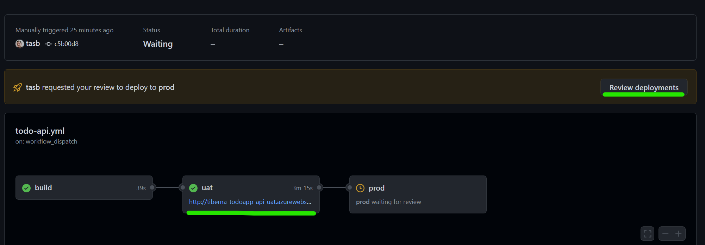

Now you can navigate to your application running on Staging environment by click on the link below `stg` stage and check everything is working on that environment. You need to perform this steps on `Todo Webapp` workflow.

After testing you feel comfortable to allow Production deployment. To do that, click on `Review deployments` button to approve that stage to run.

Click on the checkbox near the name of your environment and click on `Approve and deploy` button as stated on next image.

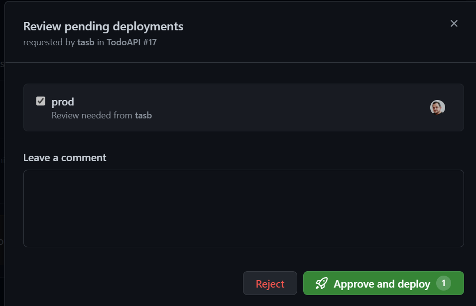

This stage will take several minutes to finish since you are creating your infrastructure in Azure.

You need to repeat this stepson both workflows.

After stage is finished, you may navigate to our production environment by clicking on the url under `prod` stage on your workflow.

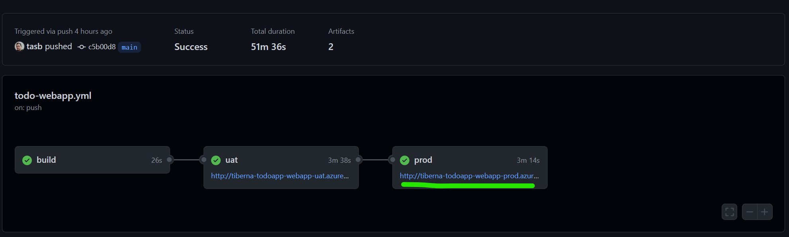

Take a little while a navigate [Azure Portal](https://portal.azure.com/)  and check all resources you just created. Since all are sharing the same subscription you'll see a lot of resources created by all attendees, so please interact only with your resources.

## Enable security tools

Since you have your CI/CD pipeline ready and making deploy directly to your Azure infrastructure, is important to have security checks to keep your application code as secure as possible.

Let's enable automatic check provided by GitHub about your dependencies graph and secret scanning.

Navigate to `Settings` > `Code security and analysis` and enable the following checks.

- Dependency graph
- Dependabot alerts
- Dependabot security updates
- Secret scanning

You should have a configuration like. Be aware that `Code scanning` should be disable since you will only enable it on next step.

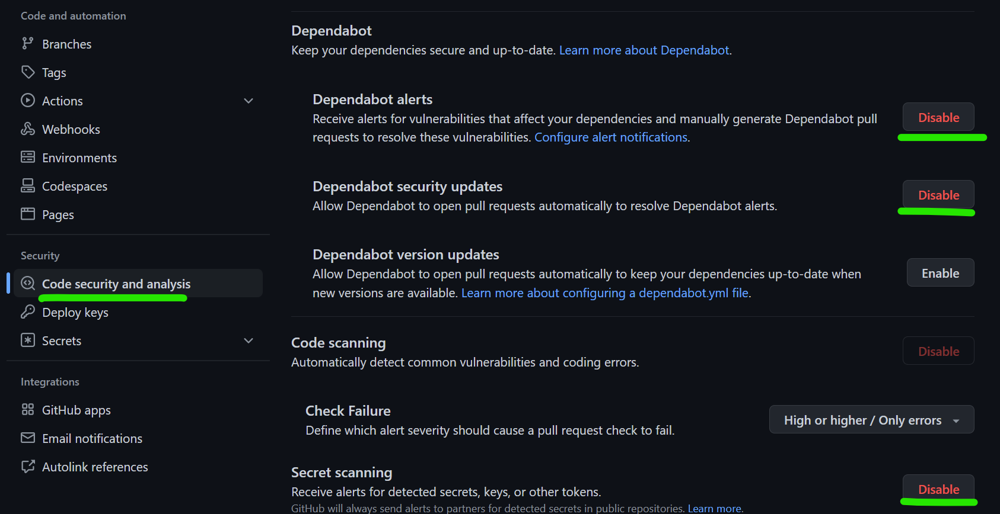

As soon as you enable it, GitHub automatically starts scanning your dependencies to find any known vulnerabilities.

To get the scanning report navigate to `Insights` > `Dependency graph` and take a look on the amount of dependencies your code have, since this feature scans recursively all your dependencies.

## Create SAST pipeline

Last step to have your Secure DevOps approach on your CI/CD pipeline is to perform a SAST scan on your code on any change you produce. We will use GitHub Code QL integration to easily set up this scan for you.

To set up the scanning navigate to `Security` menu and click on `Set up code scanning`. On new screen click on green button `Configure CodeQL alerts`.

GitHub will automatically verify your repo and check which languages are available on your source code and set up the workflow to scan that languages.

You may confirm that by check line 35 as you'll see this: `language: [ 'csharp', 'javascript' ]`

To save this file you need to commit the changes to a new branch using GitHub web interface. To do that click on `Start commit` button on top right and select `Create a new branch for this commit and start a pull request` option, setting `add-codeql` as branch name.

To finish the commit, click on `Propose changes` button.

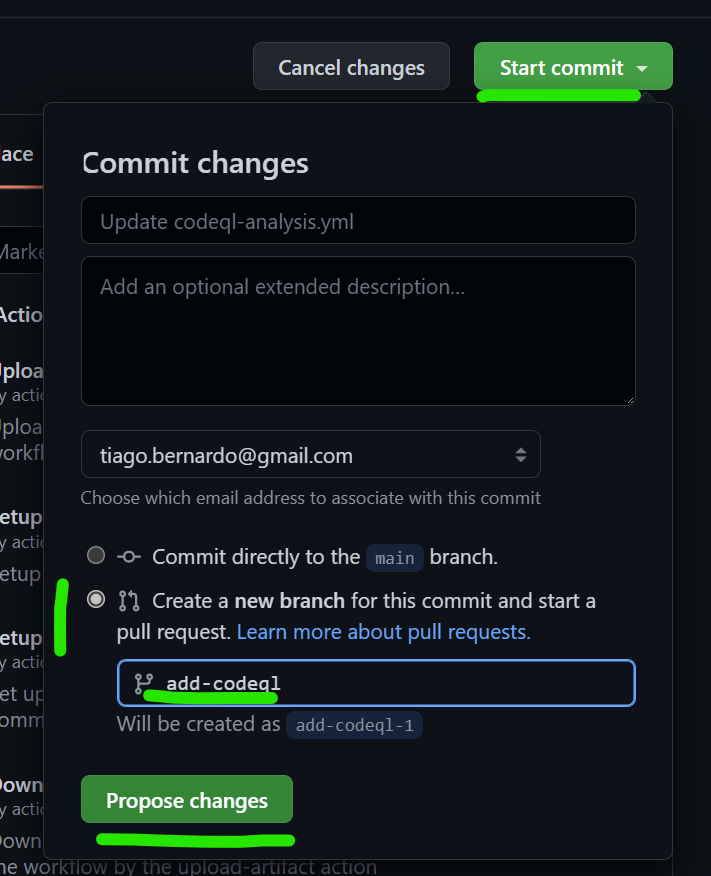

Now if you check pull request you just created you may see that this new workflow is running and check your code for some vulnerabilities.

Complete your pull request to add this new workflows on your `main` branch.

This Code QL scanning will populate code scanning alerts on your repo and you have a list of them navigating to `Security` > `Code scanning alerts`.

On this case, you may have access to 3 high priority alerts on your Javascript code.

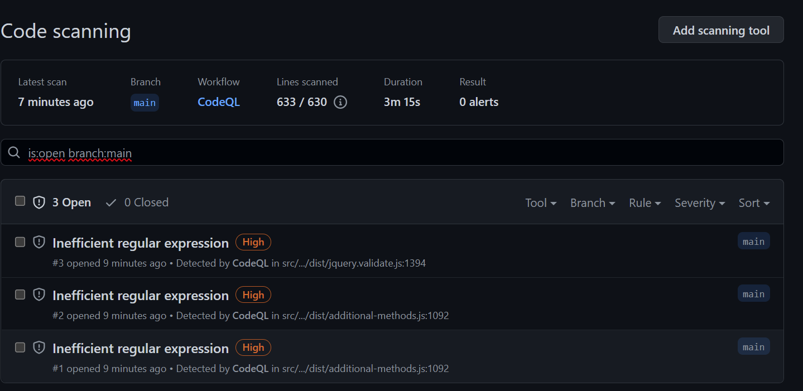

You may click on each of them to have better understanding about this alerts and on this case check that all of the alerts are on JQuery code.

Now you've everything set up and your CI/CD pipeline is ready to be used on a daily basis!

You can now make any change on your homepage (`src/TodoWebapp/Views/Shared/_Layout.cshtml`) and see your pipelines running and te new homepage being available on both Staging and Production environments.

## Clean up resoures

Now is time to clean up you resources using Terraform to do it in a easy and faster way.

Let's configure a new workflow that only runs manually and will delete all previously created resources.

First, you need to update your local repo.

```bash
git checkout main

git pull
```

Then create a new branch to add the clean up workflow.

```bash
git checkout -b add-cleanup-workflow
```

Add a new file named `cleanup.yml` on `.github/workflows` folder and add the following content.

```yaml
name: CleanUp

on:
  workflow_dispatch:

jobs:
  build:

    runs-on: ubuntu-latest

    steps:
    - uses: actions/checkout@v3

    - uses: actions/upload-artifact@v3
      with:
        name: todoapp-iac
        path: deploy/terraform

  stg:
    environment: 
      name: stg
    runs-on: ubuntu-latest
    needs: build

    env:
      ARM_CLIENT_ID: ${{ secrets.ARM_CLIENT_ID }}
      ARM_CLIENT_SECRET: ${{ secrets.ARM_CLIENT_SECRET }}
      ARM_SUBSCRIPTION_ID: ${{ secrets.ARM_SUBSCRIPTION_ID }}
      ARM_TENANT_ID: ${{ secrets.ARM_TENANT_ID }}

    steps:
    - uses: actions/download-artifact@v3
      with:
        name: todoapp-iac
        path: ./terraform

    - uses: hashicorp/setup-terraform@v2
      with:
        terraform_wrapper: false

    - name: terraform init api
      run: |
        cd ./terraform/todo-api
        terraform init -backend-config="key=todoapp.webapi.stg.tfstate"

    - name: terraform plan api
      run: |
        cd ./terraform/todo-api
        terraform plan -destroy -var="dbPassword=${{ secrets.DB_PASSWORD}}" -var="env=stg"

    - name: terraform destroy api
      run: |
        cd ./terraform/todo-api
        terraform destroy -var="dbPassword=${{ secrets.DB_PASSWORD}}" -var="env=stg" -auto-approve

    - name: terraform init webapp
      run: |
        cd ./terraform/todo-webapp
        terraform init -backend-config="key=todoapp.webapp.stg.tfstate"

    - name: terraform plan webapp
      run: |
        cd ./terraform/todo-webapp
        terraform plan -destroy -var="env=stg"

    - name: terraform destroy webapp
      run: |
        cd ./terraform/todo-webapp
        terraform destroy  -var="env=stg" -auto-approve

  prod:
    environment: 
      name: prod
    runs-on: ubuntu-latest
    needs: stg

    env:
      ARM_CLIENT_ID: ${{ secrets.ARM_CLIENT_ID }}
      ARM_CLIENT_SECRET: ${{ secrets.ARM_CLIENT_SECRET }}
      ARM_SUBSCRIPTION_ID: ${{ secrets.ARM_SUBSCRIPTION_ID }}
      ARM_TENANT_ID: ${{ secrets.ARM_TENANT_ID }}

    steps:
    - uses: actions/download-artifact@v3
      with:
        name: todoapp-iac
        path: ./terraform

    - uses: hashicorp/setup-terraform@v2
      with:
        terraform_wrapper: false

    - name: terraform init api
      run: |
        cd ./terraform/todo-api
        terraform init -backend-config="key=todoapp.webapi.prod.tfstate"

    - name: terraform plan api
      run: |
        cd ./terraform/todo-api
        terraform plan -destroy -var="dbPassword=${{ secrets.DB_PASSWORD}}" -var="env=prod"

    - name: terraform destroy api
      run: |
        cd ./terraform/todo-api
        terraform destroy -var="dbPassword=${{ secrets.DB_PASSWORD}}" -var="env=prod" -auto-approve

    - name: terraform init webapp
      run: |
        cd ./terraform/todo-webapp
        terraform init -backend-config="key=todoapp.webapp.prod.tfstate"

    - name: terraform plan webapp
      run: |
        cd ./terraform/todo-webapp
        terraform plan -destroy -var="env=prod"

    - name: terraform destroy webapp
      run: |
        cd ./terraform/todo-webapp
        terraform destroy -var="env=prod" -auto-approve
```

Let's check some parts of this file.

```yaml
on:
  workflow_dispatch:
```

The trigger of this workflow is different from the previous ones since you only want to run it manually, so you don't have any reference for push or pull request events.

Then let's take a look on Terraform actions.

```yaml
 - name: terraform init webapp
   run: |
    cd ./terraform/todo-webapp
    terraform init -backend-config="key=todoapp.webapp.stg.tfstate"

- name: terraform plan webapp
  run: |
    cd ./terraform/todo-webapp
    terraform plan -destroy -var="env=stg"

- name: terraform destroy webapp
  run: |
    cd ./terraform/todo-webapp
    terraform destroy  -var="env=stg" -auto-approve
```

You'll execute 4 times `init > plan > destroy` cycle to delete all resources. Check that on `init` phase you're using the same `tfstate` file used on provisioning phase.

Let's repeat the process to update your `main` branch.

```bash
git add -A

git commit -m "Added clean up workflow"

git push --set-upstream origin add-cleanup-workflow
```

Now that you have the branch on remote repo you need to create and complete your pull request.

Try to do it by yourself and if needed, take a look on previous explanations about how to do it.

To finalize, you need to execute manually your workflow.

Navigate to `Actions` menu, select `CleanUp` workflow available on the list on the left and select `Run Workflow` as stated on below image.

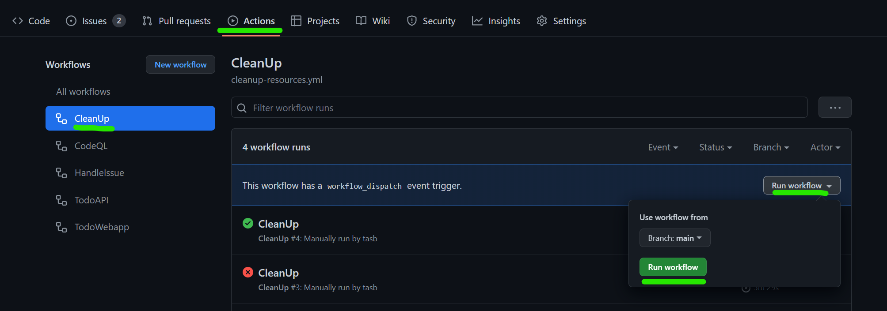

Remember that you're still using GitHub environment to you need to approve the execution of `prod` stage to delete your production environment.

After all your stage execute successfully you may have a screen like this.

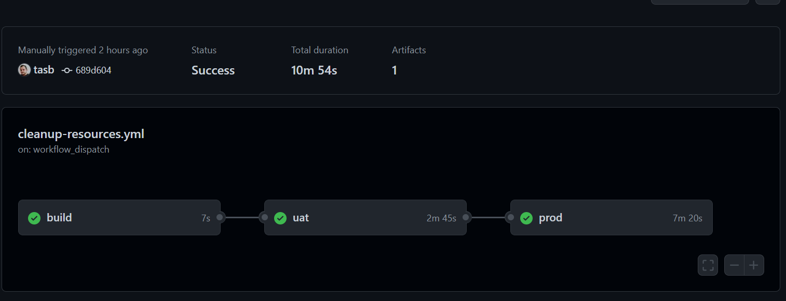

Now you can go back to [Azure Portal](https://portal.azure.com/) and check that all resources previously created are now deleted and your subscription are clean.

We've done this manually but the flow is exactly the same if you want to include provisioning and deletion of a temporary environment for testing purpose inside your full CI/CD pipeline

## Congratulations

You just finished last lab on this DevOps Fundamentals training! Hope this lab help you to have a good hands-on experience with Infra as Code and creating a full CI/CD pipeline!
